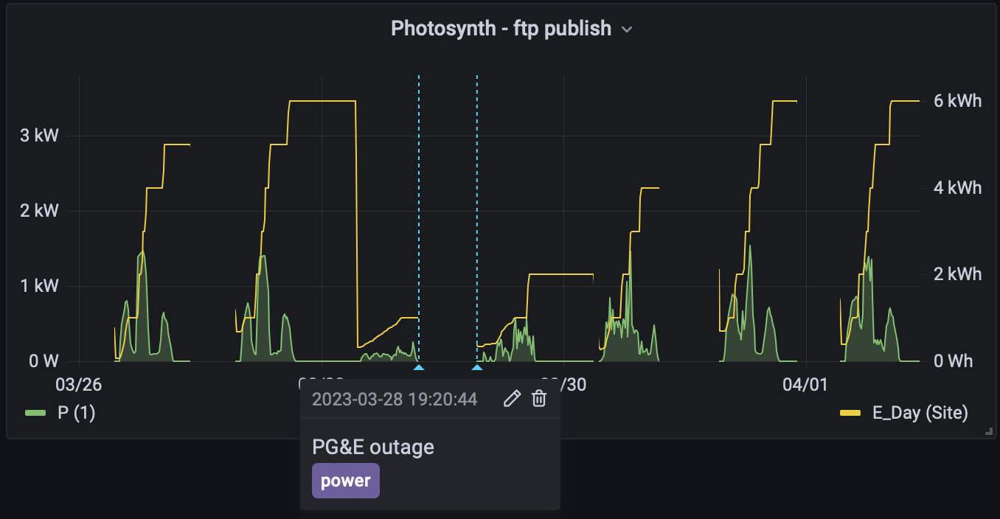

# fronius-to-influxdb #

Take data published from a Fronius Datamanager 2.0 and publish it to InfluxDB.

The CLI tool currently understands the inverter and powerflow json output that can be automatically pushed onto an ftp server. Since data can get large over time when uncompressed, this supports iterating through compressed tar archives with the same file content.

The daemon polls the datamanager url and submits the translated stats to a live influxdb.

Both of these tools can compliment each other or be used completely independently.

## Usage ##

```
fronius-to-influx (C) Tim Spriggs

froniustoinflux [OPTIONS] [FILES/DIRS/TAR.GZ/TAR.XZ]
  Parse data from a Fronius Data Logger and send it to influxdb

Common flags:
  -i --influx-protocol=ITEM  connect via http, https or udp (default)
  -h --host=ITEM             default: 127.0.0.1
     --port=INT              default: 8086
     --processed=ITEM        destination for processed files (preserves
                             relative paths from current directory)
  -? --help                  Display help message
  -V --version               Print version information

fronius-to-influx takes data logged to an FTP server and converts it to
influxdb for easier digestion of the data (eg: grafana)

This tool supports iterating through tar archives that libarchive natively
detects. In practice this brings storage of stats down from 70MB/day down to a
few hundred kB.

The tool expects data files to be named as *.powerflow and *.inverter
```

```
fronius-to-influxd (C) Tim Spriggs

froniustoinfluxd [OPTIONS]
  Poll data from a Fronius Data Logger and send it to influxdb

Common flags:
  -i --influx-protocol=ITEM  connect via http, https or udp (default)
  -h --host=ITEM             default: 127.0.0.1
     --port=INT              default: 8086
     --poll-interval=INT     seconds between polls
  -d --datamangeruri=ITEM    the base datamanager URI
  -? --help                  Display help message
  -V --version               Print version information

fronius-to-influxd takes data from a live datamanager card and converts it to
influxdb for easier digestion of the data (eg: grafana)
```

eg:
```
% ~/.cabal/bin/fronius-to-influxd \
    --influx-protocol http \
    --host influxdb.example.com \
    --datamanageruri=http://myinverter.example.com
```

## Examples ##

| Image | Description |
|-------|-------------|
|  | Data published to an ftp server by a DataManager 2.0 card. fronius-to-influxdb is run on a schedule which pushes the data to InfluxDB. This is the resulting grafana view of instantaneous power of one inverter (green) and overall site power produced (yellow.) <br/><br/> Tags have been added in grafana to show a power outage event.|

## Building ##

I used cabal `3.8.1.0` and ghc `9.2.7` on macOS for development. You may be able to get it to work with older or newer environments. Archive decompression requires linking against native libs.

### macOS + homebrew ###

```
# lzma support
% brew install xz ghc cabal-install
   ...
# Tell cabal about lzma in homebrew
% open ~/.cabal/config
   ... look for and set appropriately:
extra-include-dirs: /opt/homebrew/include
extra-lib-dirs: /opt/homebrew/lib
```

Then, `cabal install` should work from within the source tree.

### debian ###

```
$ sudo apt install zlib1g-dev liblzma-dev libarchive-dev ghc cabal-install
```

Then, `cabal install` should work from within the source tree.

## Performance ##

I did not focus on optimizing the performance of this tool. In my test configuration, the tool can read/convert statistics faster than my InfluxDB (hosted on a single board computer) can process them.

## Local Testing ##

I urge you to test before sending data into InfluxDB. One easy way to do this is with netcat (nc) and the UDP protocol support:

Terminal 1 displays the line output from the tool: (ctrl-c to quit)
```
% nc -vukl 8089
```

Terminal 2 is used to run the tool on your data:
```
% fronius-to-influx --protocol=udp --port=8089 test_data/some_archived_data.tar.xz
```

## Data mapping ##

An example file `20230318/120000.solarapi.v1.inverter`:

```json
{
  "Body": {
    "DAY_ENERGY": {
      "Unit": "Wh",
      "Values": {
        "1": 1000
      }
    },
    "PAC": {
      "Unit": "W",
      "Values": {
        "1": 670
      }
    },
    "TOTAL_ENERGY": {
      "Unit": "Wh",
      "Values": {
        "1": 40622000
      }
    },
    "YEAR_ENERGY": {
      "Unit": "Wh",
      "Values": {
        "1": 46000
      }
    }
  },
  "Head": {
    "RequestArguments": {
      "Query": "Inverter",
      "Scope": "System"
    },
    "Status": {
      "Code": 0,
      "Reason": "",
      "UserMessage": ""
    },
    "Timestamp": "2023-03-18T12:00:03-07:00"
  }
}
```

Is transformed into the following line format for InfluxDB:

```
inverter,id=1,unit=Wh DAY_ENERGY=1000i 1679166003000000000
inverter,id=1,unit=W PAC=670i 1679166003000000000
inverter,id=1,unit=Wh TOTAL_ENERGY=40622000i 1679166003000000000
inverter,id=1,unit=Wh YEAR_ENERGY=46000i 1679166003000000000
```

Similar is done for powerflow data.

## TODO ##

* plumb auth support for influxdb client connections
* support skipping files (on the filesystem and in archives)
* support other data formats exported by the datamanager
* add "stdout" protocol for data debugging

## Development Notes ##

### Code formatting ###

```
fourmolu --mode inplace cli daemon lib tests
```
